# i am MM.

## Links

[Live Site](https://mtmanning93.github.io/iam-mtmanning/)

[Repo](https://github.com/mtmanning93/iam-mtmanning)

## Intro

An online portfolio for Matt Manning, Junior Software Developer, created using the Bootstrap 5.2.3 framework. The site holds capabailties to download a printable CV or testimonials document, view showcase projects and connect with Matt via a 'Lets work together form'. The goal of the site is for Matt to have an online presence and showcase some of his abilities, whilst future employers and collaborators can view his work, and get to know him and his history. For the user the site gives a concise introduction to Matt and the ability to gain copies of his documents. The site is a single page format to replicate the simplicity and impact of a single page resumé.

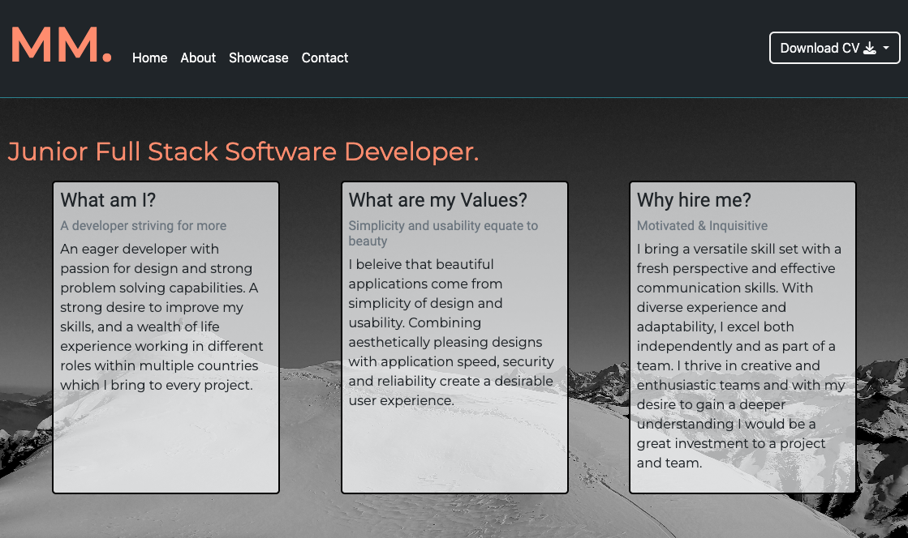

## Contents

1. [Features](#features)
    - [Header](#header)
      - [Logo](#logo)
      - [Nav](#nav)
      - [Download Button](#download-button)
      - [Intro](#header-intro)
    - [Profile](#profile)
      - [Personal Info](#personal-info)
      - [Technical Skills](#technical-skills)
      - [History](#history)
    - [Showcase](#showcase)
      - [Show Cards](#show-cards)
      - [GitHub API](#github-api)
    - [Contact & EmailJS API](#contact--emailjs-api)
    - [Footer](#footer)
2. [Future Implementations](#future-implementations)
3. [Testing](#testing)
    - [Local](#local)
      - [Validation](#validation)
      - [Lightouse](#lighthouse)
    - [Remote](#remote)
    - [Bugs](#bugs)
5. [Deployment](#deployment)
6. [Credits](#credits)

## Features

- ### Header

  - #### Logo

    To create a simply design the site owners initials 'MM.' were used as the logo, creating a brand like persona from the beginning. The font used is Monterrat as it gives adequate spacing to the text. The logo is also a link to the home page, and, when hovered turns from white to the light orange used site white for clickable and important messages.

    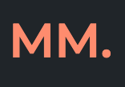

  - #### Nav

    Directly next to the logo is the site nav bar. It is simply with just 4 links and also uses a hover effect to allert the user to which link they are clicking. As the site is a single page the links simply scroll to the relavant sections of the page.

    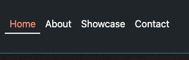

  - #### Download Button

    A dropdown 'Download CV' button positioned top right of the entire site enables the user to gain printable copies of cv and testimonial documents. The button uses a style which is carried throughout the site in order to provide the user with feeback that they are about to interact with the site.

    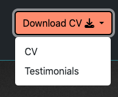

  - #### Header Intro

    The first section of the site contains the title 'Junior Full Stack Software Developer' enabling users to see directly the occupation. Within the sectio are 3 cards which detail a short introduction to Matt. These concise snippets of information would help grab the users attention initially entising them to continue reading, discovering more. When hovered the border changes to a teal for some light user interaction this is used site wide over certain elements of importance such as the navbar and footer also.

    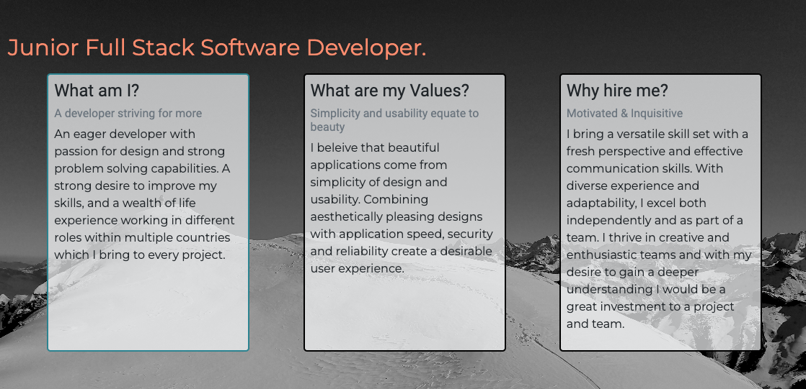

- ### Profile

  - #### Personal Info

    The personal information section is contained in a side section with dark background to help seperate information for the user. Within this section key inofrmation can be found as well as buttons which open up extra sidebars to show information regarding less important topics, regarding interests and a previous project which show key soft skills.

    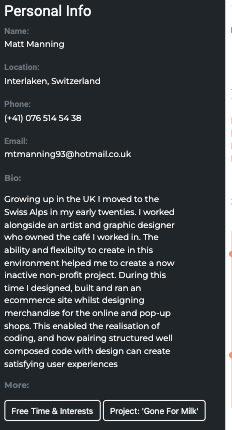
    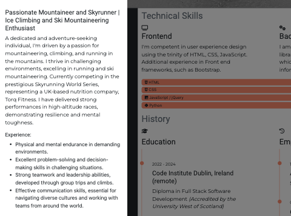

  - #### Technical Skills

    Technical skills are split into two sections 'frontend' and 'backend' both of which have their own corresponding icon for even more clarity to the user. Beneath these are some progress bars to visualise current competence in different programming languages.

    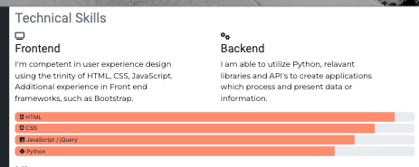

  - #### History

    In the history section there are two timeline visuals for education and employment again with the respective icons and brief descriptions of each point on the timeline.

    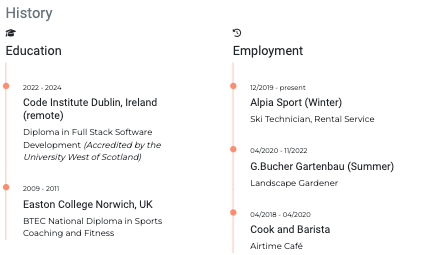

- ### Showcase

  - #### Show Cards

    For the showcase section seperate cards were used to provide images and brief description of the project and skills used in the project. Under this are buttons which link to the live site and the repo of each project.

    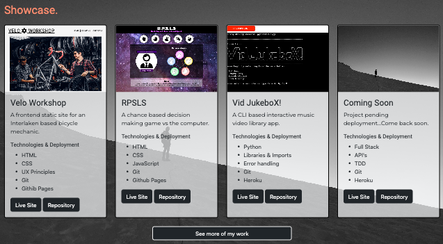

  - #### GitHub API

    Underneath the show cards is a button to 'See more of my work'. When clicked this button opens a modal with the Github API inside. Its default search is set to 'mtmanning93' showing more repos of the site owner, however, this can be used to search the entirity of GitHub and display the followers, following and repos of this user.

    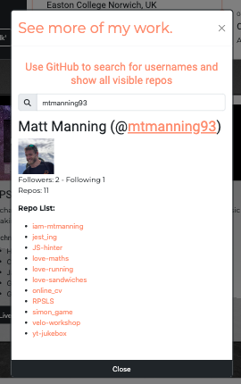

- ### Contact & EmailJS API

  After the showcase section comes the contact form which enables users to directly contact the owner with their key information and ideas. The form uses the reuire attribute to force the user into entering name, email and comment, and if they have it the GitHub username and LinkedIn url. Allowing the owner to view the users work and profile before replying.

  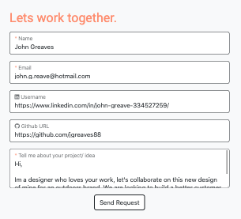

  The form is wired up to the [EmailJS API](https://www.emailjs.com/). Meaning the user can send a request directly to the owner, while the site owner can recieve all necessary information to reply or review the users profiles. Once a request is sent the user recieves a confirmation messageon the site personalised with their name input and ability to send a new request.

  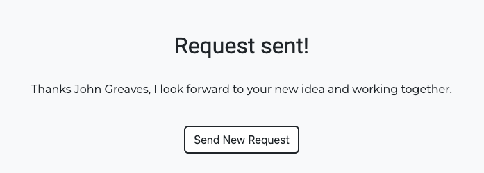

- ### Footer

  Colored the same as the navbar the footer contains another 'download cv' link to a pdf and social links. All links interact when hovered, changing color to the familiar orange which a user knows is for clicking.

  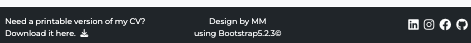

## Future Implementations

In the future the site would develop a different format with different pages for each nav link due to the increase in collaborations, projects and requests. Another chnage could be a slideshow style gallery in place of the cars for the showcases.

In the near future the background image of the title header would be changed to a suitable clear image of the owner whilst maintaining the black and white style.

## Testing

- ### Local

  - #### Validation

  - #### Lighthouse

- ### Remote

- ### Bugs

During the testing phase I found that the form wouldnt reset to the same size as before when clicking the 'send new request' button after sending an initial request. This was fixed by altering a variable within the `assets/js/sendEmail.js` file to the outer elements `.innerHTML`. 

## Deployment

The site was deployed using GitHub Pages in the following 7 steps:

 1. In the GitHub repository navigate to the `settings` tab.
 2. Within the settings tab find the `pages` section in the left menu.
 3. From here scroll down to `build and deployment` section
 4. In the section select:
    - source: `deploy from a branch`
    - branch: `main`
 5. Click `save`.
 6. After a few minutes refresh the page. This leaves the link to the deployed site in a notification box at the top of the settings/pages tab.
 7. Finally click `visit site`.

## Credits